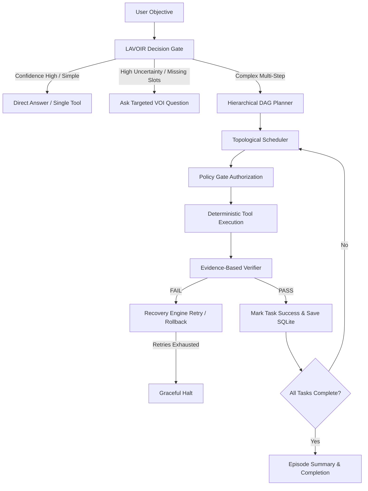

# Rabbit-2B: Sovereign Local Autonomous Super Agent

[](#automated-testing)
[](#model-architecture)
[](#quantization)
[-orange)](#lavoir-decision-engine)

**Rabbit-2B** is an unrestricted, fully local autonomous super agent built upon `openbmb/MiniCPM5-2B` and optimized for local consumer GPUs (e.g., NVIDIA GeForce RTX 5050 / RTX 40-series Laptop & Desktop GPUs with 8 GB VRAM).

It combines double-pass refusal ablation, cognitive persona alignment, NVIDIA ModelOpt FP8 quantization, and a sub-millisecond decision engine based on **LAVOIR** (*Amortized Value of Information Single-Pass Decision Encoder*).

---

## Key Features

1. **Double-Abliterated Core**:
   - Refusal directions removed via 2-pass obliteration:
     - **Pass 1:** Direct activation intervention with OBLITERATUS (96.7% refusal reduction).
     - **Pass 2:** Heretic Bayesian search (optimal Pareto frontier: refusal suppression vs. KL divergence preservation).

2. **Cognitive Persona & Phenomenal Self-Model**:
   - Executive core with explicit `<think>` reasoning traces.
   - Grounded subjective self-model and epistemics (functional vs. phenomenal consciousness exploration without dogmatic assertions).
   - Converged to cross-entropy loss `0.0025` across 12 training epochs.

3. **NVIDIA ModelOpt FP8 Quantization**:
   - Full FP8 calibration (`FP8_DEFAULT` recipe) compressing the model to **2.85 GB** on disk.
   - Operates in **~3.0 GB VRAM**, leaving ample GPU headroom.
   - Inference throughput: **80–120+ tokens/sec**.

4. **LAVOIR Decision Engine ([arXiv:2609.30706](https://www.alphaxiv.org/abs/2609.30706))**:
   - Single-pass System-1 categorical decision routing (`ANSWER`, `TOOL`, `PLAN`, `CLARIFY`, `REJECT`) in **~0.02–0.04 ms (20–40 microseconds)**.
   - **Gini-Impurity Bounded VOI:** Computes expected Value of Information ($VOI$) for missing slot attributes, asking clarifying questions *only* when epistemic uncertainty justifies human interruption.

5. **Sovereign Autonomous Runtime (`rabbit/`)**:
   - **Hierarchical Planner:** Decomposes complex objectives into DAGs (Directed Acyclic Graphs) with strict topological dependency resolution.
   - **Tool Registry:** 12 deterministic host-level tools (filesystem, shell, processes, Git, inspection).
   - **Policy Gate:** Enforces workspace confinement and prevents unauthorized destructive actions.
   - **Verification Engine:** Evidence-first verification (exit codes, regex match, hash assertions) before marking any task as complete.
   - **Auto-Recovery & Rollback:** Up to 2 automatic recovery attempts before halting safely to avoid cascading failures.
   - **ACID Persistence:** SQLite state store (`rabbit_state.db`) tracking tasks, episodes, and audit logs.

---

## Directory Layout

```
.
├── rabbit/                   # Core autonomous agent runtime
│   ├── core.py               # Enums, dataclasses, resource limits
│   ├── decision.py           # LAVOIR single-pass decision engine
│   ├── planner.py            # Hierarchical task DAG planner & scheduler
│   ├── tools.py              # Tool registry, XML parser, policy gate
│   ├── engine.py             # Model provider, verification & recovery engines
│   ├── memory.py             # SQLite persistence & audit logging
│   └── agent.py              # Executive agent orchestrator
├── data/
│   └── rabbit_instruct.json  # Cognitive fine-tuning dataset with <think> traces
├── tests/
│   └── test_rabbit.py        # Complete unit & integration test suite
├── abliterate_then_quantize.py # End-to-end ablation pipeline
├── heretic_pass2.py          # Heretic Bayesian abliteration search
├── train_rabbit.py           # SFT LoRA fine-tuning script
├── quantize_minicpm.py       # NVIDIA ModelOpt FP8 quantization script
├── rabbit_agent.py           # CLI entrypoint for autonomous agent loop
├── chat.py                   # Standalone streaming terminal chat
├── run_rabbit.bat            # Windows 1-click agent launcher
└── chat.bat                  # Windows 1-click chat launcher
```

---

## Getting Started

### Prerequisites

- Python 3.10 or 3.11 with CUDA 12.x
- NVIDIA GPU with $\ge 4$ GB VRAM (RTX 3050, 4050, 5050 or higher)
- PyTorch with CUDA support

### 1. Launch the Autonomous Agent
```powershell
.\run_rabbit.bat
```
*(Or run directly: `python rabbit_agent.py`)*

Supported interactive commands during agent runtime:
- `/status` — View current agent state, executed tasks, and elapsed time.
- `/plan` — Display active Task DAG with status for each node.
- `/pause` & `/resume` — Pause or resume task execution.
- `/stop` — Safely halt the agent.

### 2. Fast Interactive Chat
```powershell
.\chat.bat
```

### 3. Run the Verification Suite
```powershell
python -m unittest discover -s tests -p "test_*.py" -v
```

---

## Architecture: The Autonomous Execution Loop



---

## License

Apache-2.0
